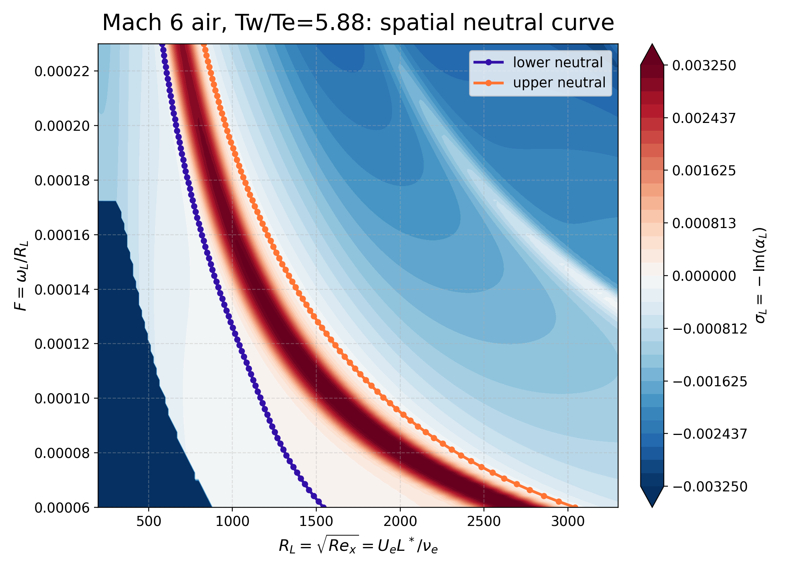
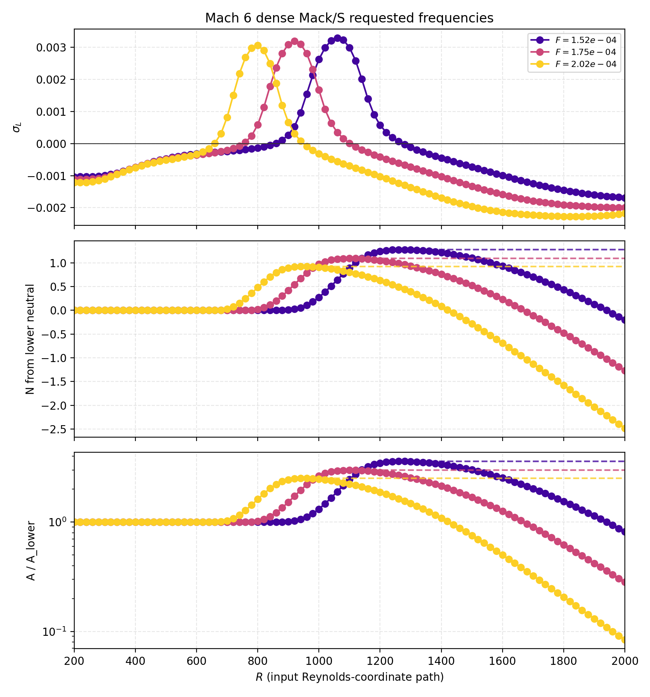

# pyMack

**pyMack: local linear stability solver for compressible and hypersonic
boundary layers.** A from-scratch Chebyshev spectral-collocation solver for
disturbance **growth rates, eigenvalue spectra, neutral curves, and N-factors**
— focused on **Mack modes**.

[](https://github.com/BARDAK1995/pyMack/actions/workflows/ci.yml)
[](https://doi.org/10.5281/zenodo.20588214)

Named after Leslie M. Mack, author of *Boundary-Layer Linear Stability Theory*
(AGARD-R-709, 1984).

> To our knowledge, no open-source Python compressible LST solver existed before
> this — pyMack fills that gap.

---

## What it does

- **Temporal and spatial** stability of compressible boundary layers via
  Chebyshev spectral collocation (full spectrum — the second mode is found
  without an initial guess).
- **Growth rates, neutral curves, and N-factor** ($e^N$) amplification.
- **First (Tollmien–Schlichting) and second (Mack) modes**; 2D and oblique waves.
- Built-in base flows: incompressible Blasius, compressible self-similar
  (adiabatic / isothermal walls), and Özgen flat-plate profiles — plus a
  **standalone boundary-layer profile generator** (`generate_boundary_layer`)
  with CSV/SI export and automatic cold-wall continuation.
- **Sharp-cone support** via the Mangler transformation (`pymack.cone`,
  `--geometry cone` in the canonical runner) — see
  [`docs/CONE_WORKFLOW.md`](docs/CONE_WORKFLOW.md).
- Pure Python — depends only on `numpy`, `scipy`, `matplotlib`.

## Mach 6 results

At Mach 6 the boundary layer is dominated by the second (Mack) mode. pyMack
resolves its neutral curve and amplification directly:



*Spatial neutral curve for the Mach 6 second mode: filled contours of spatial
growth rate $\sigma_L=-\mathrm{Im}(\alpha_L)$ in the
$(R_L=\sqrt{Re_x},\ F=\omega_L/R_L)$ plane, with the lower and upper neutral
branches (purple / orange) enclosing the unstable ($\sigma_L>0$) region.*



*Fixed-frequency spatial results for three frequencies: spatial growth rate
$\sigma_i$ (top), N-factor measured from the lower neutral point (middle), and
amplitude ratio (bottom).*

## Background

At hypersonic speeds (Mach ≳ 4), transition is driven not by the viscous
Tollmien–Schlichting (first) mode but by **Mack's second mode** — a
trapped-acoustic instability that resonates between the wall and the relative
sonic line. Linear stability theory gives its growth rate as a function of
frequency and Reynolds number; integrating that growth yields the N-factor used
for transition prediction. pyMack solves the compressible stability eigenvalue
problem with a spectral method, returning the complete spectrum at each station.

## Validation

pyMack follows a **layered validation strategy** — high-precision *tables* and
*independent codes* as CI-enforced gates, literature figures as qualitative
demonstrations. Full rationale and status:
[`docs/VALIDATION_STRATEGY.md`](docs/VALIDATION_STRATEGY.md).

| What | Benchmark | Result |
|---|---|---|
| Incompressible eigenvalues | Orszag (1971) plane Poiseuille | 5+ significant figures |
| Compressible mean flow | Mack (1984) Table 11.1 thicknesses | < 0.5% |
| Compressible temporal growth, oblique 3D | Mack (1984) Table 10.1, 6th & 8th order | 0.07–0.91% |
| **Compressible spatial eigenvalue** | **Malik (1990) Table IX, Test Case 6** (M=4.5 second mode) | α matches to ~5×10⁻⁶ — inside the published literature spread |
| Spatial cross-method consistency | dense QEP vs `solve_spatial` vs Newton vs Gaster vs Muller | independent operators ≤2×10⁻⁴; within-family ≤10⁻⁶ |
| **End-to-end dimensional neutral curve** | **Independent LST code** (Mach 5.35 N₂ flat plate) | upper branch MAE 3.2 mm (200–600 kHz); lower branch MAE 1.3 mm (330–600 kHz) — CI-gated |

> The low-frequency lower-branch difference vs the independent benchmark is a
> documented open investigation (mode-family bookkeeping), not noise — see the
> strategy doc. Exact 1:1 reproduction of individual Mack/Özgen *figures* is
> deliberately out of scope as a validation gate.

### Verification audit (literature & cross-code)

Beyond the CI gates above, pyMack carries a standalone **verification audit** that
runs **benchmark cases at the published conditions** of Mack (1984), Malik (1990),
Balakumar & Malik (1992), Ma & Zhong (2003), Özgen & Kırcalı (2008), Egorov et al.
(2006), and an external collaborator code — and reports agreement *honestly*,
including where pyMack disagrees. Every verdict (with metrics, provenance, and
convergence checks) lives in
[`verification/SUCCESS_MATRIX.md`](verification/SUCCESS_MATRIX.md); methodology in
[`verification/README.md`](verification/README.md). Tiers: **≤5 % agrees**,
**5–15 % acceptable**, otherwise **disagrees**.

**The second (Mack) mode — pyMack's design target — is validated against multiple
independent sources across Mach 4.5–10 and on a cone:**

| Benchmark | Mode / quantity | Result |
|---|---|---|
| Mack (1984) Fig 10.6 | second-mode max growth, **M=4.5→10** | 1–7 % (M10 4.0 %) |
| Ma & Zhong (2003) | M=4.5 second-mode neutral branches | Branch I/II to ~3 % |
| Balakumar & Malik (1992) | M=4.5 spatial eigenvalue + discrete/continuous branch structure | α_r exact; α_i ~10 % (literature spread) |
| Egorov, Fedorov & Soudakov (2006) | M=6 DNS-vs-LST second mode | most-amplified frequency ~7 % |
| Sivasubramanian & Fasel (2015) | **M=6 sharp cone** N-factor (Mangler path) | N ≈ 7.1 vs ~7–8 |

> **Honest limitation.** pyMack's **first mode** at low-to-moderate Mach is
> systematically **under-amplified** — confirmed across Özgen (M2–6) and Mack
> Figs 10.1 / 10.3 / 10.4, and the dominant source of the "disagrees" rows in the
> matrix. pyMack is built and validated for the **second (Mack) mode**; first-mode
> growth-rate and neutral-curve results should be treated with caution. This is
> stated plainly rather than hidden — see the matrix for every case, including the
> numerical-artifact checks that distinguish real disagreements from box-size /
> mode-selection / reference-digitization errors.

## Install

```bash
git clone https://github.com/BARDAK1995/pymack
cd pymack
pip install -e .
```

Requires Python ≥ 3.9.

## Testing

```bash
# Install with development dependencies
pip install -e ".[dev]"

# Run the validation test suite
pytest validation/ -q
```

The `validation/` directory contains the main benchmark tests (Orr-Sommerfeld, Mack mean flow, Table 10.1 oblique growth, spatial amplification guardrails, etc.).

## Usage

Runnable scripts and examples:

- `scripts/run_mach6_spatial_neutral_case.py`: canonical Mach 6 second-mode
  spatial workflow. It runs one fixed-frequency sweep, extracts lower/upper
  neutral branches, integrates N/amplification, and writes a manifest recording
  `stitching=none` and `smoothing=none`.
- `scripts/compute_spatial_neutral_curve.py`: lower-level spatial neutral curves.
- `scripts/compute_spatial_fixed_frequency_curves.py`: lower-level fixed-frequency growth and N-factor inputs.
- `scripts/compute_mach6_growth_nfactor.py`: legacy Mach 6 envelope workflow.
- `validation/`: benchmark tests (incompressible core + compressible diagnostics).

Canonical Mach 6 reproduction command:

```bash
python scripts/run_mach6_spatial_neutral_case.py --quality production
```

Fast guardrail check before a long run:

```bash
python scripts/run_mach6_spatial_neutral_case.py --quality smoke
```

For the exact assumptions and artifact policy, see
[`docs/MACH6_SPATIAL_NEUTRAL_WORKFLOW.md`](docs/MACH6_SPATIAL_NEUTRAL_WORKFLOW.md).

**Dimensional plots:** convert nondimensional results (`F`, `R_L`, `alpha`,
`sigma`) to physical units (kHz, mm, 1/m) with `pymack.DimensionalEdgeState` and
the converters in `pymack.scales` — see the *Dimensional Units / Plots* section
of [`docs/LST_API_CHEATSHEET.md`](docs/LST_API_CHEATSHEET.md).

## Citing

If pyMack contributes to your work, citing it helps others discover the tool
(and makes the author happy). Citation metadata lives in
[`CITATION.cff`](CITATION.cff) — GitHub also shows a *"Cite this repository"*
button — or just run `pymack.cite()` from Python.

> Mert Senkardesler, *pyMack: local linear stability solver for compressible
> and hypersonic boundary layers* (2026). DOI: 10.5281/zenodo.20588214.
> https://github.com/BARDAK1995/pyMack

The archived release is on Zenodo — DOI
[10.5281/zenodo.20588214](https://doi.org/10.5281/zenodo.20588214). A JOSS paper
is planned.

*(If an AI assistant helped you run pyMack, just double-check that the citation
actually ends up in the final write-up. :))*

Quick silence: set the environment variable `PYMACK_NO_BANNER=1` if the little
reminders ever get in your way.

## References

1. L. M. Mack, *Boundary-Layer Linear Stability Theory*, AGARD Report 709 (1984).
2. M. R. Malik, *Numerical methods for hypersonic boundary layer stability*,
   J. Comput. Phys. **86**, 376–413 (1990).
3. S. A. Orszag, *Accurate solution of the Orr–Sommerfeld stability equation*,
   J. Fluid Mech. **50**, 689–703 (1971).
4. S. Özgen & S. A. Kırcalı, *Linear stability analysis in compressible,
   flat-plate boundary-layers*, Theor. Comput. Fluid Dyn. **22**, 1–20 (2008).
5. P. J. Schmid & D. S. Henningson, *Stability and Transition in Shear Flows*,
   Springer (2001).

## Development & AI usage

pyMack started out as an implementation of old course notes on boundary-layer
stability theory. Its incompressible core is checked against published
benchmarks (e.g. the Orszag 1971 plane-Poiseuille eigenvalue); validation of the
compressible results against the published figures of Mack (1984) and
Özgen & Kırcalı (2008) is ongoing. The code was debugged substantially with the
help of AI tools, then reorganized and refactored into a reusable package. The
author made the core modeling decisions and is responsible for the correctness
of the code and results.

## License

[MIT](LICENSE) © 2026 Mert Senkardesler.
