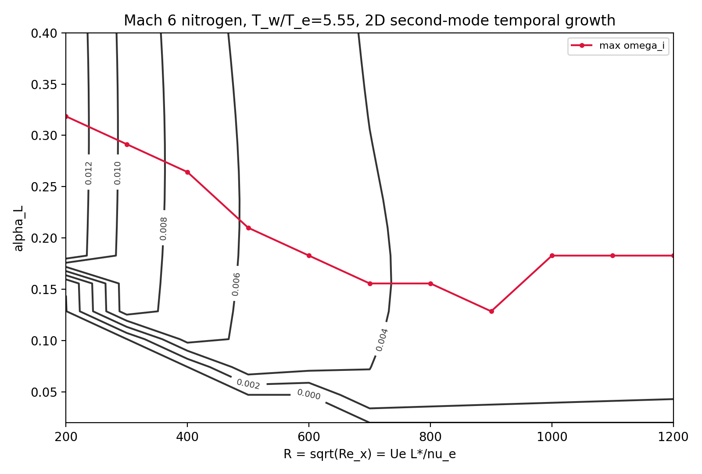

# pyMack

**Open-source linear stability theory (LST) for compressible & hypersonic
boundary-layer transition.** A from-scratch Chebyshev spectral-collocation
solver for disturbance **growth rates, eigenvalue spectra, neutral curves, and
N-factors** — including **Mack's second mode**, the instability that governs
hypersonic transition.

Named after Leslie M. Mack, author of *Boundary-Layer Linear Stability Theory*
(AGARD-R-709, 1984).

> To our knowledge, no open-source Python compressible LST solver existed before
> this — pyMack fills that gap.

---

## What it does

- **Temporal and spatial** stability of compressible boundary layers via
  Chebyshev spectral collocation (full spectrum — the second mode is found
  without an initial guess).
- **Growth rates, neutral curves, and N-factor** ($e^N$) amplification.
- **First (Tollmien–Schlichting) and second (Mack) modes**; 2D and oblique waves.
- Built-in base flows: incompressible Blasius, compressible self-similar
  (adiabatic / isothermal walls), and Özgen flat-plate profiles.
- Pure Python — depends only on `numpy`, `scipy`, `matplotlib`.

## Mach 6 results

At Mach 6 the boundary layer is dominated by the second (Mack) mode. pyMack
resolves its neutral curve and amplification directly:



*Second-mode stability diagram — contours of temporal growth rate $\omega_i$ in
the $(R=\sqrt{Re_x},\ \alpha)$ plane. The outermost ($\omega_i=0$) contour is the
neutral curve; the red line traces the most-amplified wavenumber.*


*Fixed-frequency spatial results for three frequencies: spatial growth rate
$\sigma_i$ (top), N-factor measured from the lower neutral point (middle), and
amplitude ratio (bottom).*

## Background

At hypersonic speeds (Mach ≳ 4), transition is driven not by the viscous
Tollmien–Schlichting (first) mode but by **Mack's second mode** — a
trapped-acoustic instability that resonates between the wall and the relative
sonic line. Linear stability theory gives its growth rate as a function of
frequency and Reynolds number; integrating that growth yields the N-factor used
for transition prediction. pyMack solves the compressible stability eigenvalue
problem with a spectral method, returning the complete spectrum at each station.

## Validation

| Benchmark | Result |
|---|---|
| **Orszag (1971)** — plane Poiseuille | $c = 0.23753 + 0.00374\,i$ at $Re=10^4$ (matches to 5+ significant figures) |
| **Mack (1984)** — compressible mean flow | Table 11.1 thicknesses < 0.5% error |
| **Mack (1984)** — Table 10.1 oblique first mode | 0.07–0.91% error (exact-shooting path) |
| Incompressible Blasius | Tollmien–Schlichting neutral curve reproduced |

## Install

```bash
git clone https://github.com/BARDAK1995/pymack
cd pymack
pip install -e .
```

Requires Python ≥ 3.9.

## Usage

Runnable examples and reproducible cases:

- `cases/mach535_n2/run_case.py` — full Mach 5.35 second-mode case.
- `scripts/compute_spatial_neutral_curve.py` — spatial neutral curves.
- `chapters/` — reproductions organised by chapter of Mack (1984) and of
  Özgen & Kırcalı (2008).
- `validation/` — benchmark tests.

## Citing

If pyMack supports your research, please cite it (see
[`CITATION.cff`](CITATION.cff)). A JOSS paper and an archival DOI will accompany
the first release.

## References

1. L. M. Mack, *Boundary-Layer Linear Stability Theory*, AGARD Report 709 (1984).
2. M. R. Malik, *Numerical methods for hypersonic boundary layer stability*,
   J. Comput. Phys. **86**, 376–413 (1990).
3. S. A. Orszag, *Accurate solution of the Orr–Sommerfeld stability equation*,
   J. Fluid Mech. **50**, 689–703 (1971).
4. S. Özgen & S. A. Kırcalı, *Linear stability analysis in compressible,
   flat-plate boundary-layers*, Theor. Comput. Fluid Dyn. **22**, 1–20 (2008).
5. P. J. Schmid & D. S. Henningson, *Stability and Transition in Shear Flows*,
   Springer (2001).

## Development & AI usage

pyMack started out as an implementation of old course notes on boundary-layer
stability theory, with correctness established by benchmarking directly against
the published figures and tables of the references above (Mack 1984,
Özgen & Kırcalı 2008, Orszag 1971). From there it was debugged substantially
with the help of AI tools, then reorganized and refactored into a reusable
package. All numerical results are validated against the published references,
and the author made the core modeling decisions and is responsible for the
correctness of the code and results.

## License

[MIT](LICENSE) © 2026 Mert Senkardesler.
