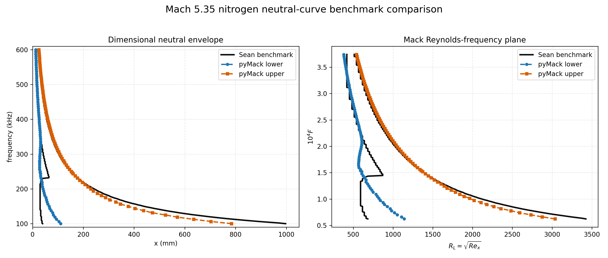

# pyMack Validation Strategy

*Why pyMack is validated the way it is — and deliberately **not** by replicating
every figure of the source papers.*

## The question

The obvious validation plan for an LST solver is: reproduce every numbered
figure of Mack (1984) and Özgen & Kırcalı (2008), 1:1. An earlier phase of this
project attempted exactly that (50+ digitized curves, per-figure tolerance
gates, a master verification harness). The result, recorded in
[`PAPER_ALIGNMENT_AUDIT.md`](PAPER_ALIGNMENT_AUDIT.md) and
[`FIGURE_GAP_MATRIX.md`](FIGURE_GAP_MATRIX.md): after substantial effort, the
strongest results were the **table-based** comparisons, while most **figure**
comparisons remained partial — and it was rarely attributable whether a gap came
from the solver, from guessing the figure's exact flow conditions, or from
digitization error.

That experience motivates a first-principles redesign.

## Why figure-by-figure replication is the wrong primary strategy

1. **Digitized figures are low-precision data.** Reading curves off 1984 scanned
   plots is good to a few percent at best (line width, scan skew, axis
   interpolation). Comparing a spectral solver that converges to 10 digits
   against pixel-read curves inverts the precision hierarchy. **Tables beat
   figures** — and the project's own two strongest validations (Mack Table 10.1
   growth rates to 0.07–0.91%; Table 11.1 mean-flow thicknesses to <0.5%) are
   both tables.
2. **Every figure carries hidden condition ambiguity.** Mack's figures mix
   Table 11.1 conditions, figure-caption wind-tunnel conditions, and unstated
   defaults. A mismatch proves nothing about the solver; diagnosing it is
   archaeology, not validation.
3. **Figures are massively redundant.** All of Mack's Ch. 10 figures are
   outputs of the *same* operator, eigenvalue solver, and mode tracker. If
   those are verified at a handful of high-precision points, the figures follow;
   the N-th figure adds almost no independent information about correctness.
4. **A wall of partial gates reads worse than a few decisive ones.** A
   validation dashboard with many FAIL/NO_CURRENT entries (mostly digitization
   noise and condition guesses) undermines exactly the trust it is meant to
   build.

Figure overlays remain useful as *qualitative demonstrations* — shapes, mode
topology, trends — so we keep a small number of them, clearly labeled, outside
the pass/fail machinery.

## The strategy: a layered validation pyramid

Each layer is verified independently, at points where the truth is known with
the highest available precision. If every layer holds, the end products
(neutral curves, N-factors) are validated by construction — and when something
breaks, the failing layer localizes it.

| Layer | What it verifies | Benchmark (type) | Status |
|---|---|---|---|
| 0 | Spectral machinery (differentiation, mapping) | Analytic functions (exact) | ✅ machine precision |
| 1 | Compressible mean flow | Mack Table 11.1 thicknesses (**table**) | ✅ < 0.5% |
| 2 | Incompressible eigenvalue problem | Orszag (1971) Poiseuille eigenvalue (**table**) | ✅ 5+ significant figures |
| 3 | Compressible temporal LST, incl. oblique 3D | Mack Table 10.1, 6th & 8th order systems (**table**) | ✅ 0.07–0.91% (exact shooting) |
| 4a | Spatial path, cross-method | Internal: dense QEP vs `solve_spatial` vs Newton vs Gaster-pipeline vs Muller at common points (**internal redundancy**) | ✅ gated (`test_spatial_cross_method_consistency.py`): independent operators agree to \|Δα_r\|≤2×10⁻⁴, \|Δσ\|≤1×10⁻⁴ at the canonical M6 point; within-family ≤10⁻⁶ |
| 4b | Spatial path, external anchor | Malik (1990) tabulated Mach 4.5 eigenvalues (**table**) | ⬜ obtain table values, implement |
| 5 | End-to-end dimensional product (base flow → spatial sweep → neutral branches → physical units) | **Independent-code benchmark:** collaborator Mach 5.35 N₂ flat-plate neutral curve (dimensional) | ✅ gated (upper branch 200–600 kHz, lower branch 330–600 kHz); low-frequency lower branch = documented open investigation |
| 6 | Qualitative literature agreement | One Mack overlay (e.g. Fig 10.6 family) + one Özgen overlay (Fig 3 lobes), from already-digitized data — **demonstrations, not gates** | ⬜ select & document |

Design principles:

- **Tables and independent codes are gates; figures are illustrations.**
- **Internal cross-method redundancy is free validation.** Two formulations
  (dense QEP, shooting) agreeing at roundoff catches sign/scaling/BC bugs that
  no single-method benchmark can.
- **One decisive benchmark per layer.** Additional benchmarks of the same layer
  are nice-to-have, not required.
- **The end-to-end layer (5) is the one users actually consume** — it exercises
  the dimensional-units machinery, branch extraction, and the full pipeline in
  the regime pyMack targets (hypersonic second mode).

## Disposition of the figure-replication assets

- The 50+ digitized reference CSVs and the target registry stay in
  `reference_data/` — they are useful data and feed the Layer-6 overlays.
- The chapter-by-chapter reproduction scripts remain in the private workspace;
  individual reproductions can be promoted later *as demonstrations* once they
  match qualitatively. They are **no longer validation requirements.**
- The known Özgen oblique first-mode discrepancy (exact shooting vs reduced
  formulations) is reclassified from "validation blocker" to a **documented
  formulation-difference investigation**: the oblique temporal path is already
  table-validated against Mack Table 10.1 at Layer 3.

## Layer-4a result (June 2026): cross-method consistency — and a pinned systematic

Running all six spatial solution paths at shared Mach 6 points showed the two
independently-implemented operators (dense companion QEP with its own
Lees–Dorodnitsyn base flow vs the main `solve_spatial` family on
`CompressibleBlasiusProfile`) agree to |Δα_r| ≈ 2×10⁻⁴, |Δσ| ≈ 10⁻⁴–10⁻⁵ (L*
units), and routes within the main family (shift-invert QEP, full spectrum,
Newton-on-temporal-EVP, Gaster-seeded pipeline, Muller) agree to ~10⁻⁶.

The study also surfaced a **real systematic, now pinned by the test suite**:
`pymack_dense` hardcodes Stokes second viscosity (λ/μ = 0) while the
`pymack.solver` family defaults to `lambda_mu_ratio = 1.2` (Mack's choice), and
`solve_spatial_muller` has no such parameter (fixed at 1.2). At the canonical
point this shifts σ_L by ~9%. Cross-operator gates therefore compare at
λ/μ = 0, the Muller gate compares against the QEP at 1.2, and one assertion
verifies the 0-vs-1.2 offset *remains finite and visible* so a silent default
change cannot slip through. Choosing/unifying the package-wide default is an
open physics-documentation item.

Also documented honestly: the dense backend's default ny=31 grid is
under-resolved beyond R_L ≈ 2000 (observed Δσ = 2.5×10⁻³ at R_L=2500 vs the
N=80 QEP) — gate points are kept below that, and production use at large R_L
should raise `ny`.

## Layer-5 result (June 2026): Mach 5.35 independent-code benchmark

A production pyMack sweep at the benchmark's recorded conditions (M=5.35, N₂,
T_e=64 K, T_w=370 K ≈ adiabatic recovery, Re′=1.176×10⁷/m, 100–600 kHz,
81 frequencies × 177 R-points, single-sweep second-mode window c∈[0.90, 0.97])
against the collaborator's dimensional neutral curve gives:

| Region | n | MAE | max abs | Verdict |
|---|---|---|---|---|
| Upper branch, 200–600 kHz | 66 | 3.2 mm | ~8.6 mm | ✅ gated in CI |
| Lower branch, 330–600 kHz | 44 | 1.3 mm | 3.5 mm | ✅ gated in CI |
| Lower branch, 100–330 kHz | — | up to ~31 mm | — | ⚠ open investigation |

The low-frequency lower-branch difference is structural, not noise: the
benchmark's lower branch stays near R≈520–860 while pyMack's clean
second-mode-window sweep places onset further downstream. Widening the
phase-speed tracking window to c∈[0.80, 1.02] was tested and *rejected* — it
degrades tracking (the continuation latches onto a different branch family)
rather than reconciling the curves. Leading hypothesis: a mode-family /
envelope-definition difference where the first- and second-mode bands interact;
note also the benchmark metadata records two unit-Reynolds values differing by
1.5%. Resolving this (robust S-mode continuation from low phase speed, and/or
clarifying the benchmark's branch bookkeeping with the collaborator) is an open
work item — and exactly the kind of physics question Layer 5 exists to surface.

Artifacts: committed under `validation/data/collaborator_mach5p35/` (pyMack
envelope, run manifest, comparison summary/errors); gates in
`validation/test_collaborator_mach5p35_benchmark.py`.

## Execution order

1. **Collaborator Mach 5.35 benchmark (Layer 5)** — matched-condition pyMack
   sweep, quantified branch-location error, tolerance-gated test, comparison
   figure. *(Best credibility-per-effort: validates the whole product path.)*
2. **Internal cross-method consistency gates (Layer 4a)** — a few (M, Re, F)
   points asserted in CI. No external data needed.
3. **Malik (1990) spatial anchor (Layer 4b)** — source the tabulated Mach 4.5
   eigenvalues from the paper, map the nondimensionalization, gate.
4. **Two qualitative overlays (Layer 6)** + this document linked from README.
5. A short `VALIDATION` summary table in the README pointing here.

Each step lands as its own public commit with tests.

---
*Adopted June 2026, replacing the figure-by-figure replication plan. The audit
trail of the earlier approach is preserved in `PAPER_ALIGNMENT_AUDIT.md` /
`FIGURE_GAP_MATRIX.md` and the private development archive.*
